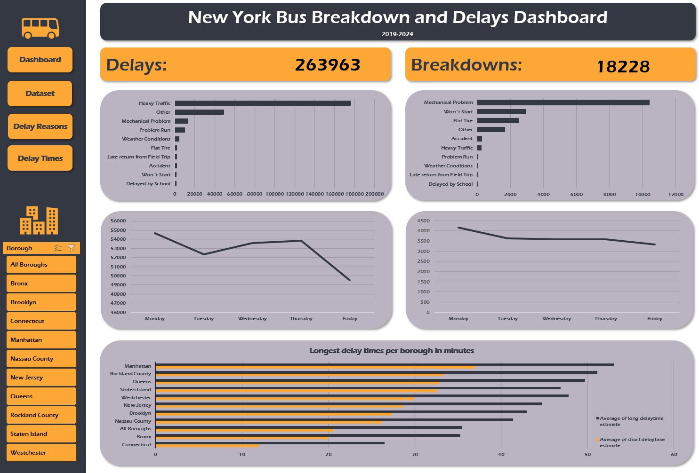

# Bus Breakdown and Delays in New York City - Analysis

## Project Description
This project analyses bus delays and breakdowns in New York City, focusing on the most common reasons for these occurrences. The key questions addressed include:
- What are the most frequent causes of delays and breakdowns?
- How do delay times vary by bus company and borough?
- Is there a correlation between specific days of the week and the frequency of breakdowns or delays?

To enhance data comprehension, an interactive dashboard with borough filters was developed. The analysis highlights the following key findings:
- Heavy traffic is the leading cause of delays, while mechanical issues are the primary cause of breakdowns.
- Delays occur most frequently on Mondays.
- Manhattan experiences the longest delays due to traffic congestion.
- The top 10 bus companies with the highest delay times were identified and examined.

## Steps Taken

### Identifying Delay and Breakdown Causes
- Created a pivot table to list and count delay and breakdown reasons.
- Visualised the data using a bar chart, sorted from largest to smallest.

### Standardising Bus Company Names
- Manually aggregated the `bus_company_name` column using filters.

### Analysing Delay Durations
- Inserted two new columns and used the 'Text to Column' feature to separate short and long delay times from the `how_long_delayed` column.
- Calculated the average short and long delays.
- Created a pivot table with standardised bus company names and visualised the data with a bar chart, filtering the top 10 bus companies with the highest delays.

### Analysing Borough-wise Delays
- Identified and updated missing values in the `borough` column using `bus_no`, `route_number`, and `school_serviced` columns.
- Inserted a pivot table to calculate the average short and long delay times by borough and visualised the findings using a bar chart.

### Determining Weekly Patterns
- Transformed the `occurred` column to identify the day of the week using the `WEEKDAY` formula.
- Converted numerical values to weekday names using `XLOOKUP`.
- Created a pivot table to analyse the correlation between specific days of the week and breakdowns/delays, visualised using a line chart.

### Creating an Interactive Dashboard
- Developed an Excel dashboard integrating all visualisations and filters for borough-specific analysis.

## Interactive Excel Dashboard

## Key Insights

### Breakdown Causes
- The majority of breakdowns occur due to mechanical problems, including issues where buses "won’t start."
- **Recommendation:** Implement more frequent preventative maintenance, potentially on a monthly or quarterly basis, to reduce mechanical failures.

### Delay Causes
- Traffic is overwhelmingly the main cause of delays.
- **Potential Solution:** Adjust bus schedules to avoid high-traffic periods, particularly for student transport.
- Nearly 14,000 delays are linked to mechanical issues, further reinforcing the need for regular servicing.

### Bus Companies with the Highest Delay Times
- The top 10 bus companies with the highest delays were identified for comparison across boroughs and total trips.
- **Recommendation:** Evaluate whether mechanical failures are a primary cause and address them with regular maintenance. If delays persist, consider reviewing contracts with underperforming companies.

### Borough-wise Analysis
- The boroughs with the highest delay times correspond to the busiest areas of NYC, where high population density and heavy traffic contribute to prolonged delays.

### Weekly Breakdown Trends
- Breakdown incidents show a gradual decline throughout the week, peaking on Mondays and decreasing towards the weekend.
- **Recommendation:** Schedule maintenance over weekends to minimise weekday breakdowns.

### Weekly Delay Patterns
- Delays peak on Mondays and decline towards Fridays.
- **Conclusion:** Since traffic is the primary cause of delays, the decrease on Fridays may be attributed to fewer commuters on the road.

## Repository Structure
- `Bus_Breakdown_and_Delays_NY.xlsx` – Contains raw data, cleaned data, exploratory analysis, and the interactive dashboard.
- `Bus_Breakdown_and_Delays_NY.jpg` – Dashboard preview image.

---
This structured analysis provides clear insights into the causes of bus delays and breakdowns in NYC, along with actionable recommendations for improvement.
